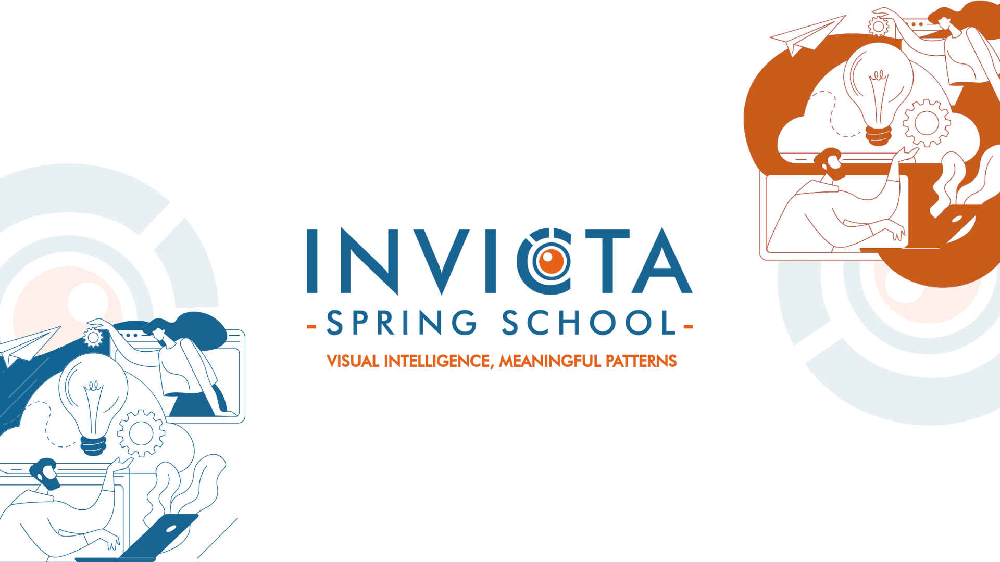

# invicta-2025

Hello and welcome to the official repository of the INVICTA Spring School 2025.

# Sessions
## Towards stronger and safer vision-language models
### by Yongshuo Zong
Talk - [Slides]()

Hands-On - ([Sessions/Towards stronger and safer vision-language models/Notebooks/](https://github.com/INVICTA-School/invicta-2025/tree/e8ba91f2dfd3b182fe263b9dab96a0d9e19a5e92/Sessions/Towards%20stronger%20and%20safer%20vision-language%20models))

Sessions/Towards stronger and safer vision-language models/Notebooks

GitHub - [GitHub](https://github.com/ys-zong)

# AI Talks

## View-to-communicate and communicate-to-view: the CONVERGE Project
### by Luís Pessoa

AI Talk - [Slides](ai-talks/)

## Building reliable GenAI systems
### by Eduardo Castro

AI Talk - [Slides](ai-talks/)
