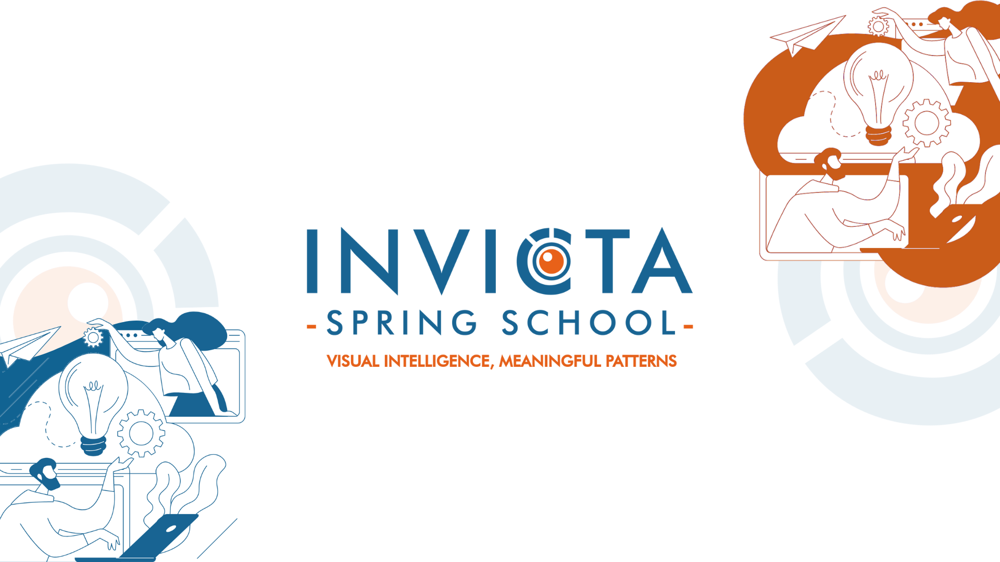

# invicta-2025

Hello and welcome to the official repository of the INVICTA Spring School 2025.

# Sessions
## Towards stronger and safer vision-language models
### by Yongshuo Zong
Talk - [Slides](https://github.com/INVICTA-School/invicta-2025/tree/947269580ecbf1146214d088fdd66af39bb60312/Sessions/Towards%20stronger%20and%20safer%20vision-language%20models/Slides)

Hands-On - [Notebook](https://github.com/INVICTA-School/invicta-2025/tree/e8ba91f2dfd3b182fe263b9dab96a0d9e19a5e92/Sessions/Towards%20stronger%20and%20safer%20vision-language%20models)

Yongshuo's GitHub - [GitHub](https://github.com/ys-zong)

## What's catching your eye? - Bioinspired and neuromorphic algorithms to model visual attention
### by Giulia d'Angelo

Talk - [Slides](https://github.com/INVICTA-School/invicta-2025/tree/1196ec89de03a207dda01a8caac1a8cfd2243318/Sessions/Whats%20catching%20your%20eye%20-%20Bioinspired%20and%20neuromorphic%20algorithms%20to%20model%20visual%20attention/Slides)

Hands-On - See GitHub Repository 

GitHub - [Tutorial](https://github.com/GiuliaDAngelo/CTU-EDNeuromorphic)

Giulia's GitHub - [GitHub](https://github.com/GiuliaDAngelo)

## Diffusion Models in Medical Imaging: From Synthetic Data to Detecting the Unknown
### by Cosmin Bercea

Talk - [Slides](https://github.com/INVICTA-School/invicta-2025/tree/55d8055d1ca1cb73dc3e36471f1f2668ada969f3/Sessions/Diffusion%20Models%20in%20Medical%20Imaging%20-%20From%20Synthetic%20Data%20to%20Detecting%20the%20Unknown/Slides)

Hands-On - See GitHub Repository 

GitHub - [Tutorial](https://github.com/compai-lab/INVICTA_tutorial)

Cosmin's GitHub - [GitHub](https://github.com/ci-ber)

## Explainable AI in Healthcare: Fundamentals, Challenges, and the Road to Trustworthy AI
### by Wilson Silva

Talk - [Slides]()

Hands-On - [Tutorial]()

Wilson's GitHub - [GitHub]()

## Knowledge Distillation: Compact Model Performance for Scalable, Green, and Efficient Deployment
### by Fadi Boutros

Talk - [Slides]()

Hands-On - [Tutorial]()

Fadi's GitHub - [GitHub]()

# Case-Study

## Generating Synthetic Retinal Fundus Images with Diffusion Models
### by Luís Rosado and Ivo Façoco

Hands-On - See GitHub Repository 

GitHub - [Tutorial](https://github.com/fraunhoferportugal/pymdma/)

# AI Talks

## View-to-communicate and communicate-to-view: the CONVERGE Project
### by Luís Pessoa

AI Talk - [Slides](https://github.com/INVICTA-School/invicta-2025/tree/20bd160c654c950f869136df47207b746a0a737b/AI%20Talks/View-to-communicate%20and%20communicate-to-view%20-%20the%20CONVERGE%20Project)

## Building reliable GenAI systems
### by Eduardo Castro

AI Talk - [Slides](https://github.com/INVICTA-School/invicta-2025/tree/aebab9214840e1bfb859df9bfded449a50e19ab8/AI%20Talks/Building%20reliable%20GenAI%20systems)

## Computer Vision and Machine Learning Challenges in Cancer Research
### by Hélder P. Oliveira

AI Talk - [Slides]()

## The AI Canvas: A Lingua Franca for AI
### by Kelwin Fernades

AI Talk - [Slides](https://github.com/INVICTA-School/invicta-2025/tree/20bd160c654c950f869136df47207b746a0a737b/AI%20Talks/The%20AI%20Canvas%20-%20A%20Lingua%20Franca%20for%20AI)

## AISym4MED - improving the healthcare data system and fostering robust medical AI
### by Luís Rosado

AI Talk - [Slides](https://github.com/INVICTA-School/invicta-2025/tree/8f72b2fe958027881becefa3e5b0f0601c6556f8/AI%20Talks/AISym4MED%20-%20improving%20the%20healthcare%20data%20system%20and%20fostering%20robust%20medical%20AI)

## Data Representativeness: What Are We Missing?
### by Susana Brás

AI Talk - [Slides](https://github.com/INVICTA-School/invicta-2025/tree/4abfbd5b63214edcb842e50417bc31d738b6b20f/AI%20Talks/Data%20Representativeness%20-%20What%20Are%20We%20Missing)

